<!--
_class: lead
_footer: 2024-05-09 @ 튜링의 사과
-->

# NextJS 시작하기

### 누구나 손쉽게 따라할 수 있어요 ^\_^v

---

<!-- footer: 자기소개 -->

# 안녕하세요? 만나서 반갑습니다 ^\_^v


> From Imagination Into Reality

안녕하세요? 저는 상상을 현실로 만드는 개발자 **나비**라고 합니다.

고객과 회사를 이어주는 <u>**채널코퍼레이션**</u>에서 프론트엔드 개발자로 근무하고 있어요.

NextJS를 사용하여 여러가지 재미있는 것들을 만들어 나가고 있습니다.

### Contact

- Mail : [hello@nabi.kim](mailto:hello@nabi.kim)
- Github : [@nabi-chan](https://github.com/nabi-chan)
- Blog : https://nabi-blog.vercel.app
- Discord : @nabi-chan

---

<!-- footer: 목차 -->

# 목차

### ~ 발표 후 얻을 수 있는 내용 미리 보기 ~

## 0. `CSR` / `SSR` 이해하기

## 1. NextJS에 대해서 알아보기

- NextJS 설치해보기
- 페이지 만들어보기

## 2. NextJS 더 잘 활용해보기

- `getStaticProps` / `getStaticPath` 로 정적인 페이지 만들어보기
- `getServerSideProps` 로 동적인 페이지 만들어보기
- API Route를 사용하여 API 만들어보기

### ~ 10분 휴식 ~

## 3. Vercel로 NextJS 앱 배포해보기

- 서비스 배포해보기
- Github 연동하기
- Vercel의 여러 기능들 알아보기

### ~ 질의응답 ~

</div>

---

<!--
_class: big-text
footer: 시작하기 전에
-->

# 시작하기 전에...

- NextJS 14버전의 pages directory를 사용합니다 (app directory가 너무 난해해서 그만...)
- 모든 예제는 TypeScript를 사용합니다. (JavaScript도 가능해요!)
- 시간상 다루지 못한 내용들이 많을것 같습니다. 자세한 내용은 공식 문서를 확인해주세요!
  - https://nextjs.org/docs/pages
  - https://vercel.com/docs
- 질문이 있다면 언제 어디서나 질문해주세요! 이 시간은 여러분들을 위한 시간입니다!

---

<!--
_class: lead
footer: CSR / SSR 에 대해서 알아보기
-->

# CSR/ SSR에 대해서 알아보기

---

# CSR (Client Side Rendering)

<div data-marpit-fragment="1">

**`app.js`**

```tsx
import { render } from "react-dom";

render(<h1>Hello, World!</h1>, document.getElementById("root"));
```

**`index.html (server)`**

```html
<div id="root"></div>
<script src="app.js"></script>
```

</div>

<div data-marpit-fragment="2">

# ⬇️

</div>
<div data-marpit-fragment="3">

**`index.html (browser)`**

```html
<div id="root">
  <h1>Hello, World!</h1>
</div>
<script src="app.js"></script>
```

</div>

---

# SSR (Server Side Rendering)

<div data-marpit-fragment="1">

**`app.js`**

```tsx
import { render } from "react-dom";

render(<h1>Hello, World!</h1>, document.getElementById("root"));
```

**`index.html (server)`**

```html
<div id="root">
  <h1>Hello, World!</h1>
</div>
<script src="app.js"></script>
```

</div>

<div data-marpit-fragment="2">

# ⬇️

</div>
<div data-marpit-fragment="3">

**`index.html (browser)`**

```html
<div id="root">
  <h1>Hello, World!</h1>
</div>
<script src="app.js"></script>
```

</div>

---

<!--
_class: lead
footer: NextJS에 대해서 알아보기
-->

# NextJS에 대해서 알아보기

---

<!-- _class: big-text -->


# NextJS, 넌 누구냐

NextJS는 Vercel에서 제작한 풀 스택 어플리케이션을 만들기에 특화된 오픈소스 웹 프레임워크입니다.

Server Side Rendering과 Static Site Generation을 지원하며,
API 엔드포인트를 만들어 풀 스택 어플리케이션을 쉽게 만들 수 있도록 도와줍니다.

주로 지원하는 기능은 다음과 같습니다 ^\_^b

- **Server Side Rendering (SSR)**
- Static Site Generation (SSG)
- **파일 기반 라우팅**
- **API Route**
- SCSS 지원 및 styled-components 기본 지원
- 이미지 / 폰트 최적화
- **타입스크립트** 기본 지원

---

<!-- _class: big-text -->

# 설치하기

0. 자주 사용하는 패키지 매니저를 터미널에서 열어줍니다. <small>(여기서는 bun을 사용할거에요!)</small>
1. `bun create next-app` 을 터미널에 입력합니다. <small>(또는 `npx create-next-app`)</small>
2. 터미널의 질문에 맞춰 내용을 작성해줍니다.

   ```bash
   - What is your project named? <프로젝트 이름>
   - Would you like to use TypeScript? > No / Yes # 타입스크립트 사용 유무
   - Would you like to use ESLint? > No / Yes # ESLint 사용 유무
   - Would you like to use Tailwind CSS? > No / Yes # tailwindcss 사용 유무
   - Would you like to use `src/` directory? > No / Yes # src/ 디렉토리 사용 유무
   - Would you like to use App Router? (recommended) > No / Yes # App Router 사용 유무
   - Would you like to customize the default import alias (@/*)? > No / Yes # import alias (relative path) 사용 유무
   - What import alias would you like configured? > ~/* # import alias 경로 (위에서 Yes를 선택한 경우에만 출력)
   - What import alias would you like configured? … ~/*
   - Creating a new Next.js app in /Users/root/Projects/<프로젝트 이름>.
   ```

3. 자주 사용하는 코드 에디터로 프로젝트를 열어보면 이제 모든 준비가 끝났습니다!

---

<!-- _class: big-text -->

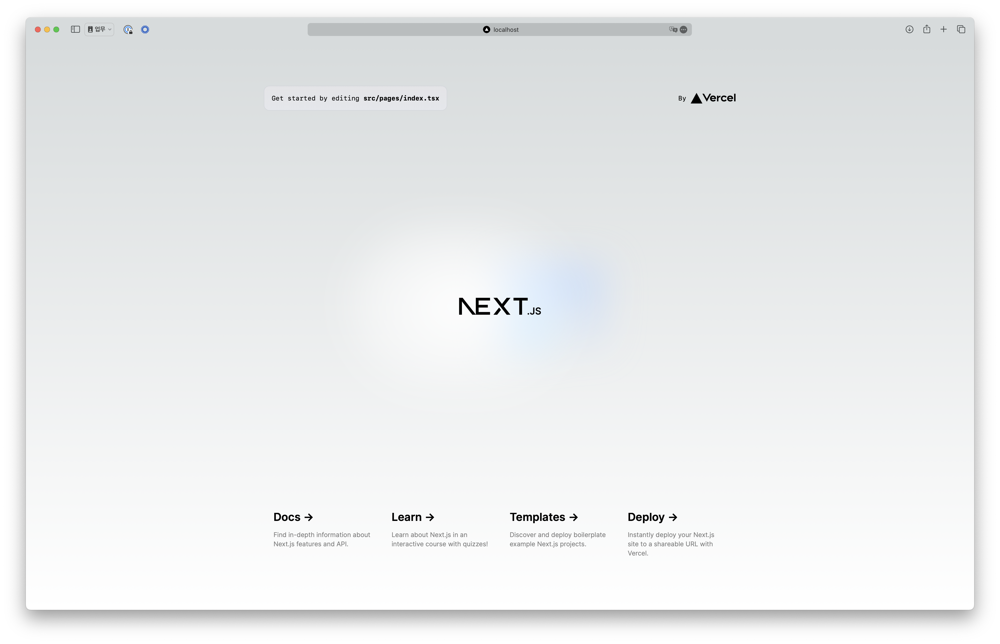

# 서버 실행해보기

1. 에디터로 프로젝트를 열어줍니다.
2. 터미널을 열고 `bun dev` 를 입력합니다.
3. `http://localhost:3000` 을 브라우저에 입력하면...
4. 페이지가 표시됩니다! (야호!)

---

# 파일 기반 라우팅 이해하기

<div class="only" data-marpit-fragment="1">

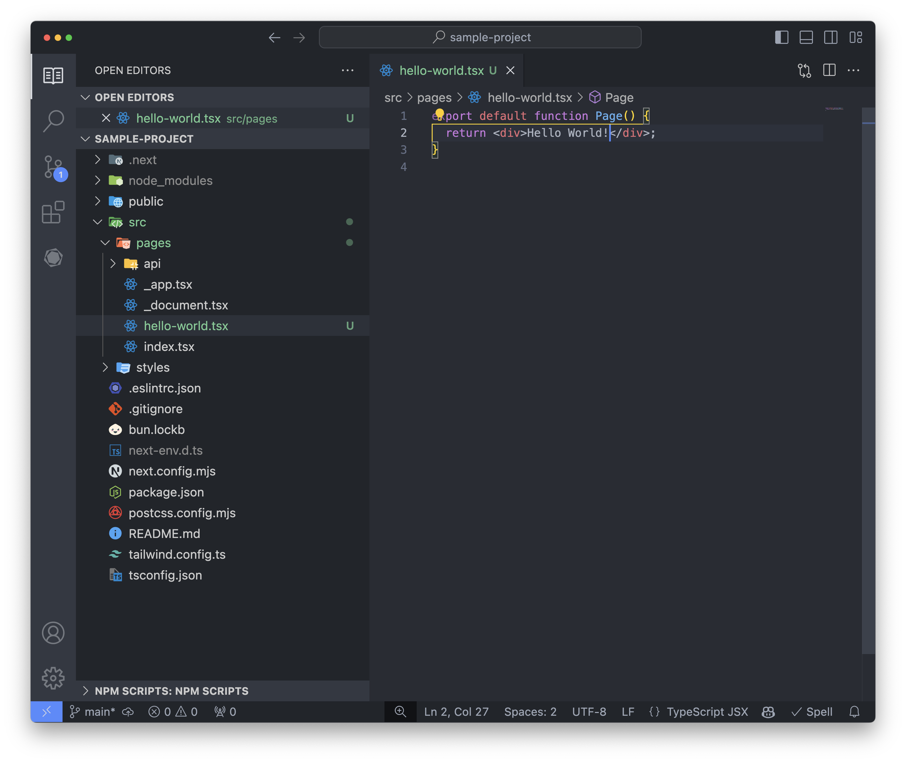

</div>
<div class="only" data-marpit-fragment="2">

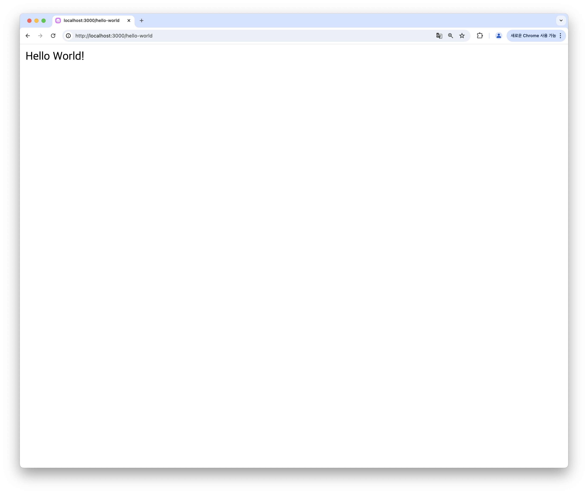

</div>

NextJS에서는 `/pages` 폴더의 경로를 기반으로 페이지 라우팅을 지원합니다.

예를 들어, `/pages/hello-world.tsx` 라는 페이지가 있다면,
`http://localhost:3000/hello-world` 로 경로가 설정됩니다.

| 파일 경로                     | 페이지 라우팅         |
| ----------------------------- | --------------------- |
| `/pages/hello-world.tsx`      | `/hello-world`        |
| `/pages/dynamic/[id].tsx`     | `/dynamic/1234`       |
| `/pages/multiple/[...id].tsx` | `/multiple/1234/5678` |

---

# 페이지 만들기

<div class="right">

```tsx
export default function Page() {
  return <div>Hello World!</div>;
}
```

</div>

기본적으로, NextJS의 모든 페이지는 default export가 되어있어야 하며,
반드시 함수의 리턴문에 JSX 코드가 작성되어있어야 합니다..

아까 보았던 hello-world.tsx의 코드를 열어보자면... 다음과 같습니다.

---

<!--
_class: lead
footer: NextJS 더 잘 활용해보기
-->

# NextJS 더 잘 활용해보기

---

# `getServerSideProps` 로 동적인 SSR 페이지 만들어보기

<div class="only" data-marpit-fragment="1">

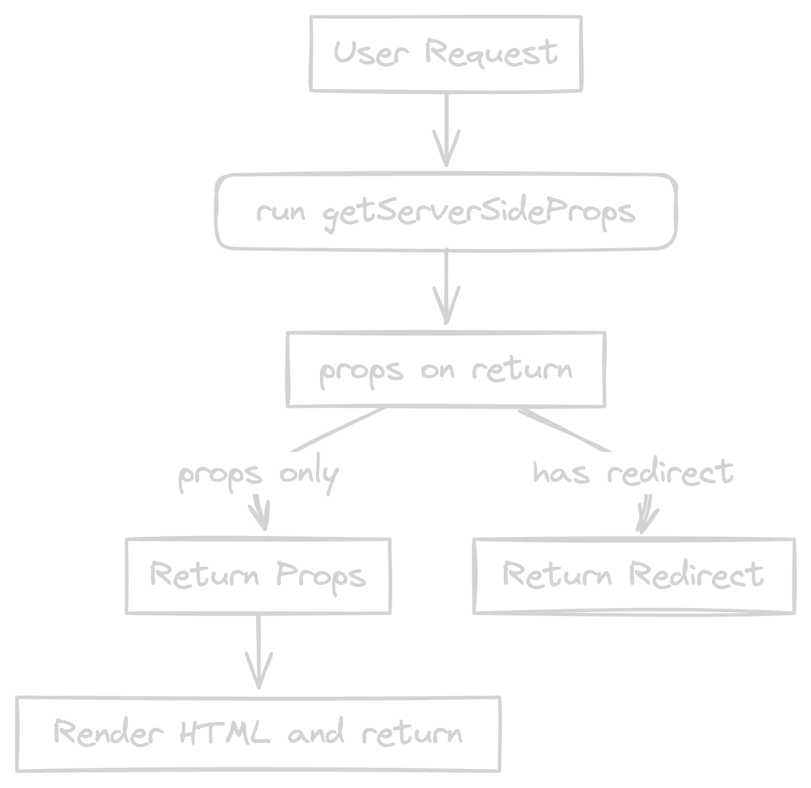

동적인 페이지를 만들기 위해 만들어진 함수입니다.

페이지를 불러올 때, 서버에서 getServerSideProps의 함수를 실행하여 prop을 만들고, 이를 페이지에 prop으로 내려 렌더링을 합니다.

</div>

<div class="only" data-marpit-fragment="2">

**`/pages/product-list.tsx`**

```tsx
export default function Page({ products, total }: PageProps) {
  return (
    <>
      <h1>총 {total} 개의 상품</h1>
      <div>
        {products.map((product) => (
          <div key={product.id}>
            <h2>상품 {product.id} 번</h2>
            <pre key={product.id}>{JSON.stringify(product, null, 2)}</pre>
          </div>
        ))}
      </div>
    </>
  );
}

export async function getServerSideProps() {
  const { products, total } = await fetch(
    "https://dummyjson.com/products"
  ).then((res) => res.json());

  return {
    props: {
      products: products,
      total: total,
    },
  };
}
```

</div>
<div class="only" data-marpit-fragment="3">

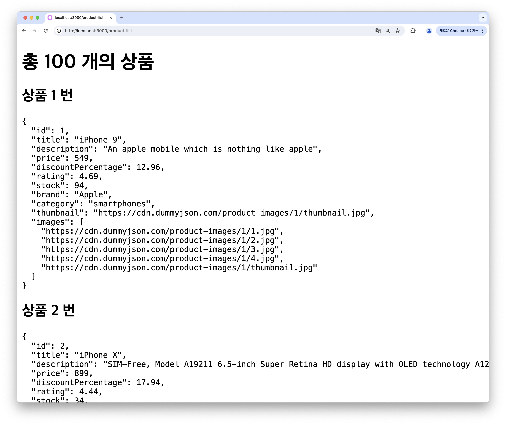

</div>

---

# `getStaticProps` 로 정적인 페이지 만들어보기

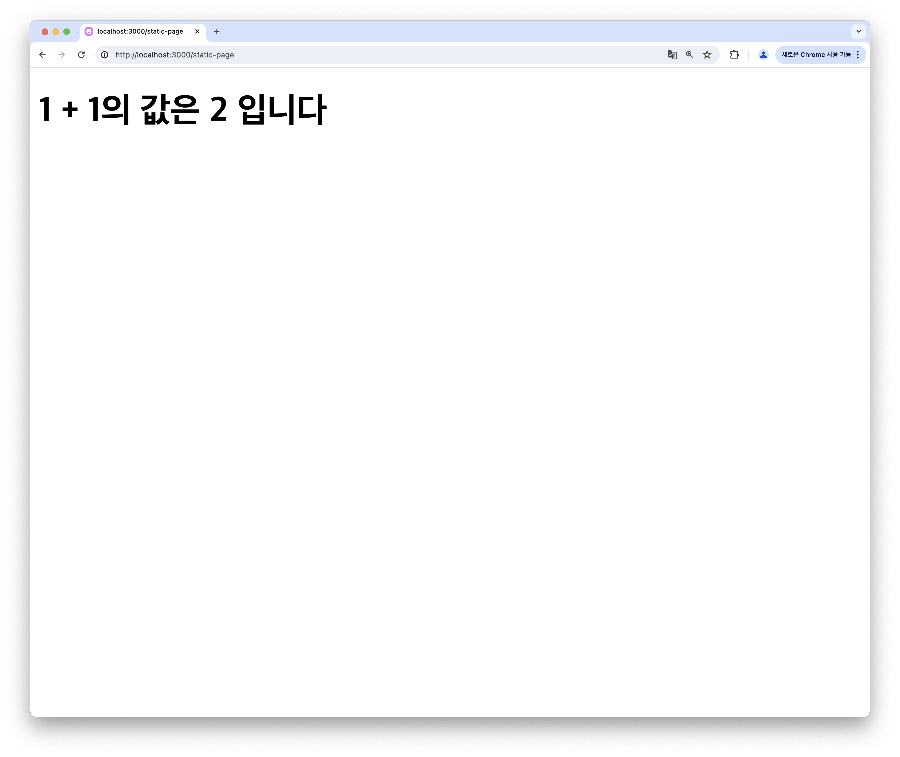

정적인 페이지를 만들기 위해 만들어진 API 입니다.
빌드시에 주어진 **prop에 맞춰 정적인 페이지를 반환**합니다.

**`/pages/static-page.tsx`**

```tsx
export default function Page({ result }: PageProps) {
  return (
    <div>
      <h1>1 + 1의 값은 {result} 입니다</h1>
    </div>
  );
}

export function getStaticProps() {
  return {
    props: {
      result: 1 + 1,
    },
  };
}
```

---

# `getStaticPaths` 로 다양한 정적인 페이지 만들기

<div class="only" data-marpit-fragment="1">

만약 페이지가 dynamic route이고, `getStaticProps`을 사용한다면,
2개 이상의 페이지를 만들어야 하는 경우에는 어떻게 코드를 작성해야 할까요?

이럴때 사용할 수 있는 것이 `getStaticPaths` 입니다.

이 함수는 dynamic route에 맞게 정적인 페이지의 경로를 만들어주는 역할을 하는 함수입니다.

예를 들어, getStaticPaths의 return문이 다음과 같으면...

**`/pages/get-static-path-test/[page-id]/tsx`**

```json
{
  "paths": [
    { "params": { "page-id": 1 } },
    { "params": { "page-id": 2 } },
    { "params": { "page-id": 3 } },
    { "params": { "page-id": 4 } }
  ]
}
```

경로는 자연스럽게 `/get-static-path-test/1`, `/get-static-path-test/2`, `/get-static-path-test/3` 과 같이 paths 배열에 있는 요소에 따라 만들어집니다.

</div>

<div class="only" data-marpit-fragment="2">

**`/pages/static-paths/[product-id].tsx`**

```tsx
// TODO: render product detail page...

export async function getStaticProps(context: GetStaticPropsContext) {
  const product = await fetch(
    `https://dummyjson.com/products/${context.params?.["product-id"]}`
  ).then((res) => res.json());

  return {
    props: {
      product: product,
    },
  };
}

export async function getStaticPaths() {
  const { products } = await fetch("https://dummyjson.com/products").then(
    (res) => res.json()
  );

  return {
    paths: products.map((product: Product) => ({
      params: {
        "product-id": product.id.toString(),
      },
    })),
    fallback: false,
  };
}
```

</div>
<div class="only" data-marpit-fragment="3">

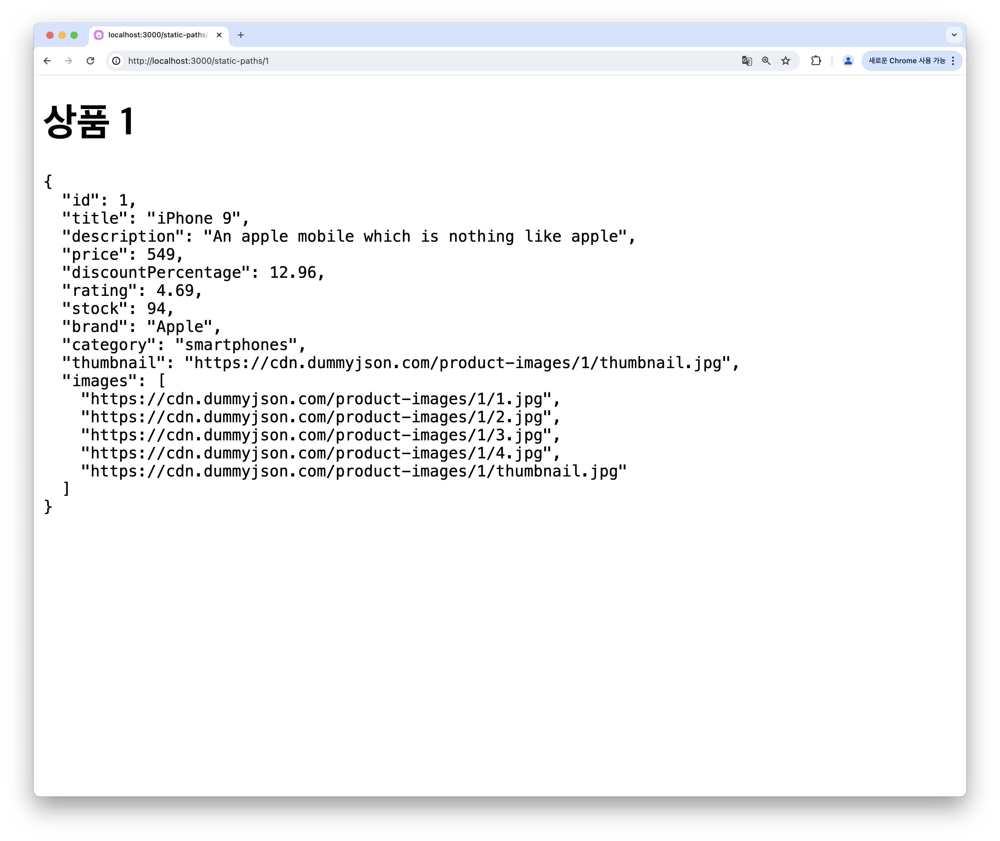

</div>

---

# API Route를 사용하여 API 만들어보기

NextJS에서 API를 만들려면, 어떻게 해야할까요?

레거시 서비스였다면, NextJS 앱 따로... Server 앱 따로 만들어야 했겠지만,
NextJS에서는 API Route를 사용해서 API를 만들 수 있습니다.

페이지를 만들때와 똑같이, `/pages/api` 폴더에 파일을 만들면 API 경로가 생성됩니다 ^\_^b

아래는 예시 코드입니다.

**`/pages/api/ping`**

```tsx
export default function handler(req, res) {
  return res.status(200).end("pong");
}
```

---

# 추가 : API Route handler 이해하기

## 1. req 안에 들어가는 값

- `req.method` : API 요청시에 클라이언트가 명시한 Method (GET / POST / PUT / ...)
- `req.cookies` : 브라우저의 쿠키, `res.cookies.get("쿠키_이름")` 의 형태로 가져옵니다.
- `req.query` : request 시에 들어가는 값들 (search query, route query) 등을 모아둡니다.
- `req.body` : API 요청시 body에 들어가는 값

---

# 추가 : API Route handler 이해하기

## 2. res 안에 들어가는 값

- `res.status(status)` : Status 코드를 설정합니다. (200, 403, 404 등등...)
- `res.json(string)` - JSON Response를 보냅니다. JSON 형태여야 합니다.
- `res.send(json)` - HTTP Response를 보냅니다. string / object / Buffer 타입을 지원합니다.
- `res.redirect(status, path)` - 주어진 URL로 리다이렉트합니다.
- `res.revalidate(path)` - getStaticProps으로 만들어진 페이지를 재생성 하도록 변경합니다.

---

# 추가 : 이것 외에도 다양한 기능들을 지원합니다.

- `@vercel/og` 를 사용한 이미지 생성
- `<Image>` 태그를 사용한 이미지 최적화
- `<Script>` 태그를 사용한 스크립트 로딩 최적화
- `new Font()` 를 사용한 폰트 프리로딩
- `next/dynamic` 을 사용한 컴포넌트 lazy loading

---

<!--
_class: lead
_footer: 휴식 시간
-->

# ~ 10분 휴식 시간 ~

질문이 있다면 편하게 질문해주세요!

---

<!--
_class: lead
footer: Vercel로 NextJS 앱 배포해보기
-->

# Vercel로 NextJS 앱 배포해보기

---

<!-- _class: big-text -->

# Vercel은 또 뭔데?


Vercel 은 front-end 어플리케이션을 무엇보다 쉽게 배포할 수 있도록 도와주는 일종의 faas (frontend-as-a-service) 입니다.

cli 나 git을 연동해 다양한 서비스를 손쉽게 배포할 수 있다는 것이 특징입니다.

이것 말고도, cron 이나 database 서비스를 직접 제공함으로써 개발자가 인프라에 크게 신경쓰지 않아도 간단하게 대규모의 서비스를 만들 수 있다는 것이 특징입니다. (최고 ^\_^b)

---

# Cli로 Vercel 서비스 배포해보기

1. `vercel` cli를 자주 사용하는 패키지 매니저로 설치해줍니다.

   ```shell
   bun global add vercel
   ```

2. 프로젝트에서 `vercel` 커맨드를 실행시킵니다.
3. 프롬포트에 뜨는 질문에 차례대로 답합니다.

   ```bash
   Vercel CLI 33.5.0
   ? Set up and deploy “~/sample-project”? [Y/n] y # 정말로 배포할것인지 여부
   ? Which scope do you want to deploy to? nabi-chan # 배포할 팀의 위치
   ? Link to existing project? [y/N] n # 기존 프로젝트의 연동할것인지 여부
   ? What’s your project’s name? sample-project # 프로젝트 이름
   ? In which directory is your code located? ./ # 코드의 위치 (모노레포에서 사용함)
   Local settings detected in vercel.json:
   Auto-detected Project Settings (Next.js):
   - Build Command: next build
   - Development Command: next dev --port $PORT
   - Install Command: `yarn install`, `pnpm install`, `npm install`, or `bun install`
   - Output Directory: Next.js default
   ? Want to modify these settings? no # 위 설정을 override 할것인지 여부
   ```

4. 배포가 완료되면 사이트에 접속해보세요!

---

<!-- _class: big-text -->

# Github 연동으로 서비스 배포해보기

<div class="only" data-marpit-fragment="1">

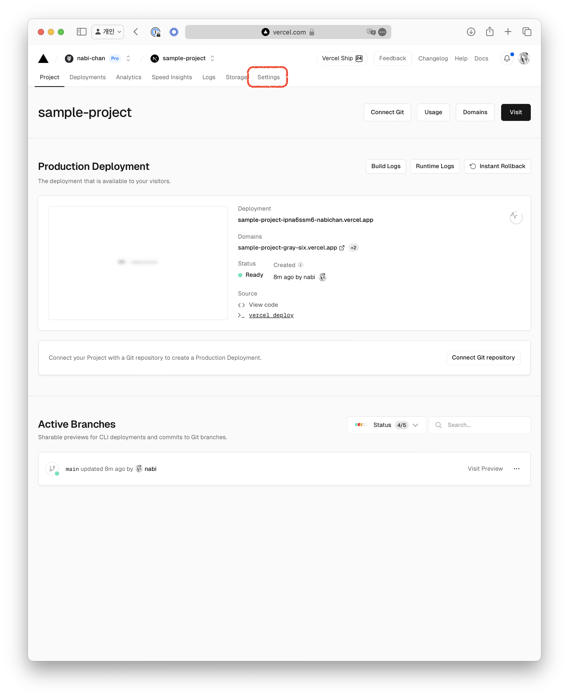

1. 프로젝트를 열고, `settings` 탭에 들어갑니다.

</div>
<div class="only" data-marpit-fragment="2">


2. `Git` 섹션에 들어갑니다.
3. `Github` 버튼을 눌러 Vercel과 Github App을 연동합니다.
4. 연결할 프로젝트를 선택하빈다.

</div>
<div class="only" data-marpit-fragment="3">

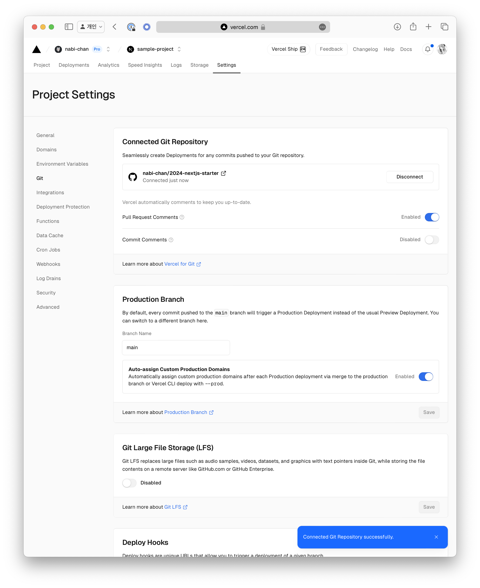

5. 연동 성공!

</div>

---

<!-- _class: big-text -->

# vercel의 여러 기능들 알아보기 (로그 보기)

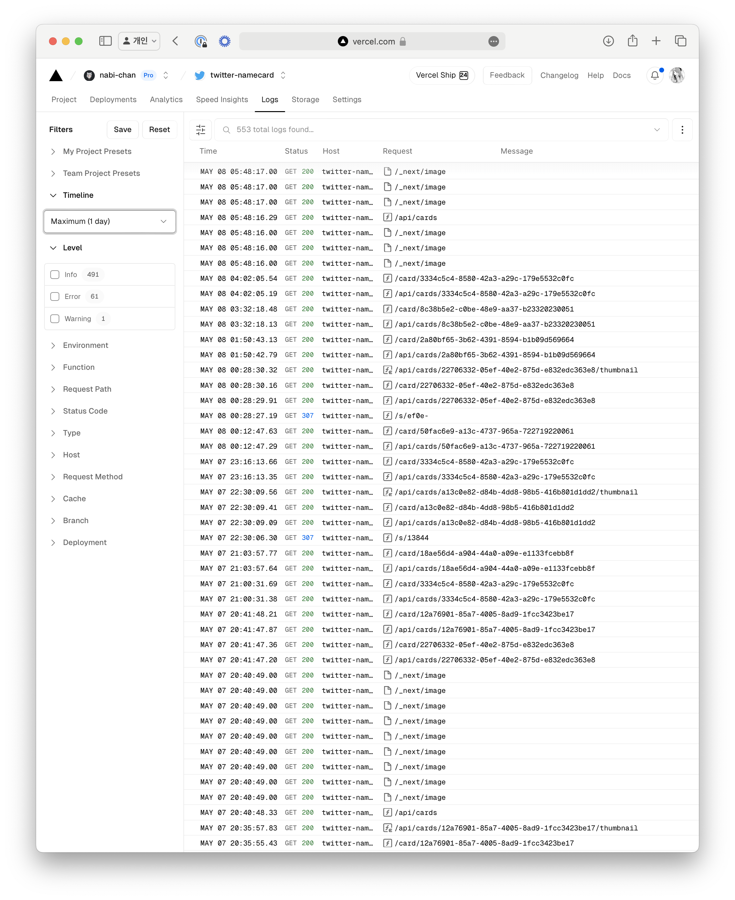

Vercel에서는 서비스의 로그를 직접 볼 수 있는 기능을 제공합니다.

`Logs` 섹션에 들어가면, 원하는 조건에 맞는 함수 실행 로그를 확인할 수 있습니다.

---

<!-- _class: big-text -->

# vercel의 여러 기능들 알아보기 (인스턴트 롤백)

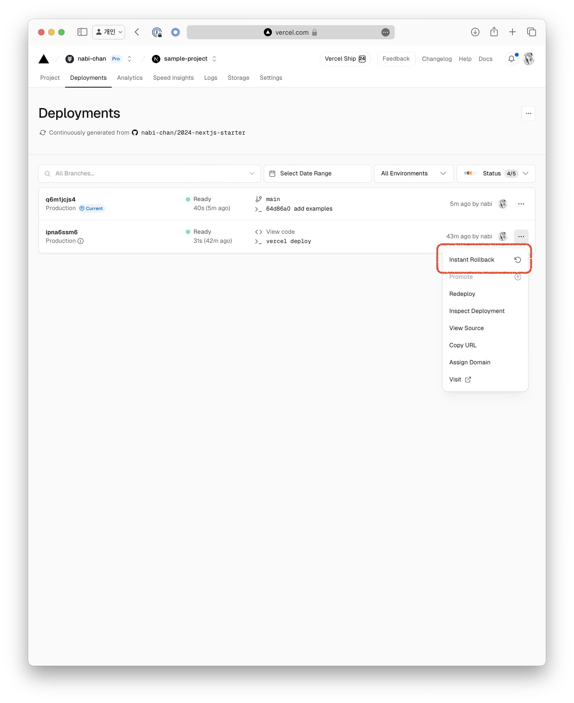

만약 방금 배포한 서비스에 오류를 일으키는 코드가 존재한다면 어떻게 해야할까요?

기존 서비스라면 다시 배포를 해야하지만...
Vercel에서는 서비스를 빠르게 롤백할 수 있는 기능을 제공합니다!

`Deployments` 섹션에 들어가, 배포 오른쪽 ... 버튼을 클릭한 다음 `Instant Rollback` 버튼을 누르면 빠르게 롤백이 됩니다 :-)

---

<!-- _class: big-text -->

# vercel의 여러 기능들 알아보기 (PR 프리뷰 코멘트)

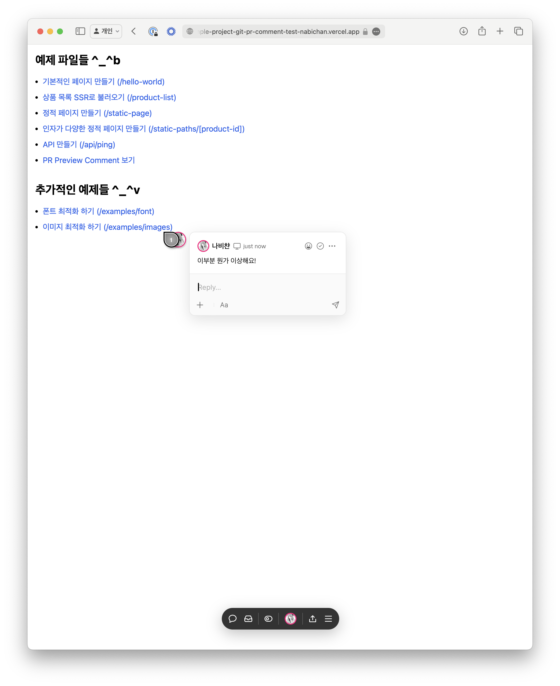

만약 여러 사람과 협업을 하는 환경이라면, pull-request preview에 comment 기능이 꽤나 유용할거에요.

이 기능은 preview deployment에서 같은 팀원이 코멘트를 직접 남길 수 있도록 도와주는 기능이에요.

오른쪽 스크린샷처럼, Vercel 게정이 있으면 자유롭게 코멘트를 달 수 있습니다!

---

<!-- _class: big-text -->

# vercel의 여러 기능들 알아보기 (특정 조건에서만 빌드 되게하기)

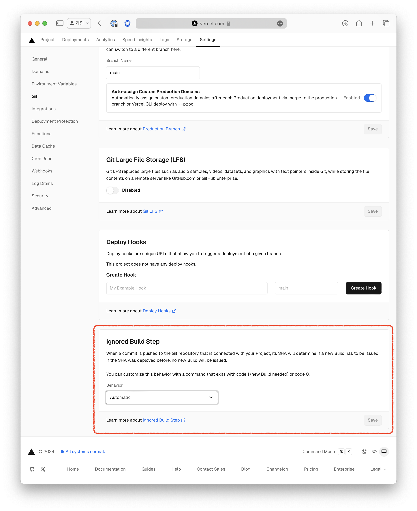

Git을 연동한 상태에서는, 모든 커밋이 푸시될 때마다 빌드가 되는 불편함이 있어요.

이 문제를 해결하기 위해서는 Ignore Build Step을 사용해 특정 조건 (production 브랜치일때 / 커밋 이름에 Build가 들어가 있을 때...) 에서만 빌드가 되도록 할 수 있습니다!

---

<!--
_class: lead
_footer: 질의응답
-->

# 질의응답 🙋‍♀️

질문이 있다면 편하게 질문해주세요!

---

<!--
_class: lead
_footer: ""
-->

# 감사합니다 🙇‍♀️

- 이메일 : [hello@nabi.kim](mailto:hello@nabi.kim)
- 발표 자료 : https://nabi-blog.vercel.app/s/2024-nextjs-starter
- 소스 코드 : https://github.com/nabi-chan/2024-nextjs-starter
